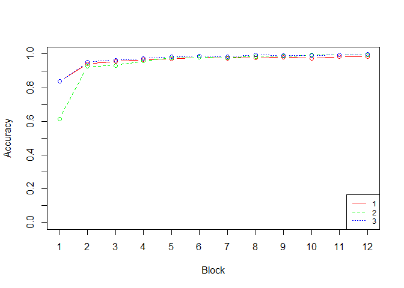

catlearn.suppls
===============

A constellation of functions that work with the catlearn package to facilitate the broad modeling goals of the [Learning and Representation in Cognition Laboratory](http://kurtzlab.psychology.binghamton.edu/).

*Package under active development*

The package can be installed using these commands:

``` r
install.packages("devtools")
devtools::install_github("ghonk/catlearn.suppls")
```

`catlearn.suppls` is intended to be used as a supplement to the `catlearn` package. It facilitates modeling with the DIVergent Autoencoder architecture (`slpDIVA()`) and features a suite of functions under development for active research projects.

Demo
====

First load the packages.

``` r
library(catlearn)
library(catlearn.suppls)
```

Set Up and Execution
--------------------

Now load some data from `get_test_inputs` and assign variables for the properties of the data. The package includes a set of classic category structures; we'll use a 4-D family resemblance + unidimensional rule category structure for this demo.

``` r
# get some sample data
test_inputs <- get_test_inputs('unifr')

# set inputs and class labels
ins  <- test_inputs$ins
labs <- test_inputs$labels

# get number of categories and features
nfeats <- dim(ins)[2]
ncats <- length(unique(labs))
```

Next, setup the model parameters. The design pattern for `catlearn` is called a *stateful list processor*. This means we provide the model with a list that contains all of the model's hyperparamters and it returns a similar list that includes the model's learned parameters (weights).

``` r
# construct a state list
st <- list(learning_rate = 0.25, num_feats = nfeats, num_hids = 3, num_cats = ncats,
  beta_val = 0, phi = 1, continuous = FALSE, in_wts = NULL, out_wts = NULL, wts_range = 1,
  wts_center = 0, colskip = 4)
```

We then use the `catlearn.suppls` package to create a training matrix, `tr`.

``` r
# tr_init makes the empty training matrix
tr <- tr_init(nfeats, ncats)

# tr_add fills in the data and procedure (i.e., training, test, model reset)
tr <- tr_add(inputs = ins, tr = tr, labels = labs, blocks = 12, ctrl = 0, 
  shuffle = TRUE, reset = TRUE)
```

Finally, we run the model with our state list `st` and training matrix `tr`.

``` r
diva_model <- slpDIVA(st, tr)
```

Inspecting Results
------------------

To examine performance we can match the output (response probabilities) to the training matrix `tr`.

``` r
# name the output columns
colnames(diva_model$out) <- paste0('o', 1:dim(diva_model$out)[2])

# Combine the inputs and outputs (if desired)
trn_result <- cbind(tr, round(diva_model$out, 4))
tail(trn_result)
```

    ##       ctrl trial blk example x1 x2 x3 x4 t1 t2     o1     o2
    ## [91,]    0    91  12       2  1  1 -1  1  1 -1 1.0000 0.0000
    ## [92,]    0    92  12       4 -1  1  1  1  1 -1 0.9992 0.0008
    ## [93,]    0    93  12       3  1 -1  1  1  1 -1 0.9973 0.0027
    ## [94,]    0    94  12       7 -1  1 -1 -1 -1  1 0.0000 1.0000
    ## [95,]    0    95  12       8  1 -1 -1 -1 -1  1 0.0005 0.9995
    ## [96,]    0    96  12       6 -1 -1  1 -1 -1  1 0.0000 1.0000

### Evaluating performance

Use `response_probs` to extract the response probabilities for the target categories (for every training step (trial) or averaged across blocks)

``` r
response_probs(tr, diva_model$out, blocks = TRUE)
```

    ##  [1] 0.7561462 0.9372188 0.9514638 0.9502348 0.9754091 0.9816299 0.9768297
    ##  [8] 0.9940707 0.9915841 0.9967900 0.9980584 0.9994837

### Plotting

`plot_training` is a simple function used to plot the learning of one or more models.

``` r
# # # run a few models
model_list <- list(slpDIVA(st, tr), slpDIVA(st, tr), slpDIVA(st, tr))
  
# # # get response probabilities
model_list_resp_probs <- 
  lapply(model_list, function(x) {
    response_probs(tr, x$out, blocks = TRUE)})

# # # plot the leanrning curves
plot_training(model_list_resp_probs)
```



### Advanced Topics

#### Examining the state of the model across training
